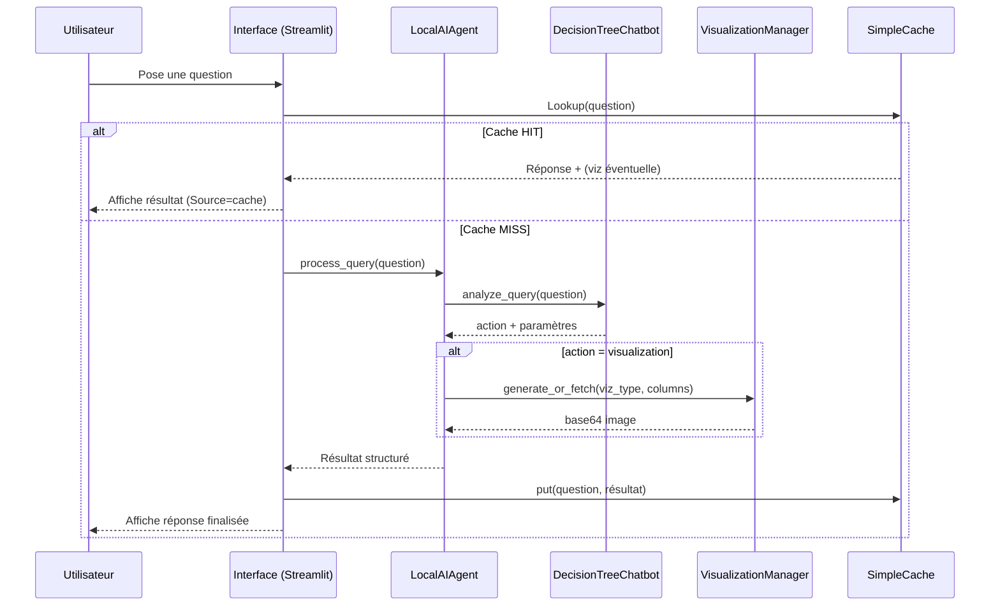

# 🧬 Architecture & Fonctionnement de l'Application

## 🎯 Objectif
Application d'analyse de données 100% locale (aucun appel vers des services externes) permettant :
1. Chargement et indexation de fichiers CSV / Excel
2. Exploration et analyses simples via un chatbot déterministe
3. Génération et réutilisation de visualisations (cache)
4. Gestion et enrichissement dynamique d'une base de prompts (exemples + custom persistants)
5. Scripts de génération de Q&A + visualisations pour enrichir la base

---
## 🗂 Structure Générale
```
app.py                       # Interface principale Streamlit
src/components/
  ai_agent.py                # LocalAIAgent : orchestration requêtes
  data_manager.py            # Gestion ChromaDB (indexation métadonnées)
  visualization_manager.py   # Génération & cache des graphiques
  simple_cache.py            # Cache clé/valeur (requête -> réponse)
  decision_tree_chatbot.py   # Routage d'intentions (règles)
src/utils/
  example_prompts.py         # Prompts d'exemple + prompts custom + suggestions viz
custom_prompts.json          # Persistance des prompts personnalisés
data/                        # Jeux de données d'exemple
chroma_db/                   # Stockage persistant ChromaDB
cache/                       # Cache simple
exports/                     # Graphiques exportés (PNG)
qa_visualizations/           # Catalogue Q&A + scripts de génération
```

---
## 🔁 Flux Global d'Interaction
1. L'utilisateur charge un ou plusieurs fichiers (sidebar)
2. Le `DataManager` charge les fichiers (Pandas) + indexe métadonnées dans ChromaDB
3. Le `LocalAIAgent` conserve un DataFrame courant (dernier chargé)
4. L'utilisateur saisit une requête (chat) ou sélectionne un prompt rapide
5. Le cache est consulté (`SimpleCache.get(query)`)
   - HIT → réponse immédiate (source=cache)
   - MISS → analyse de la requête
6. Le `DecisionTreeChatbot` détecte l'intention (summary / visualization / analysis)
7. Le `LocalAIAgent` exécute l'action correspondante
8. Si visualisation : `VisualizationManager` génère (Seaborn/Matplotlib) → encode en Base64
9. Réponse structurée (texte + éventuellement image) → ajout historique + mise en cache
10. L'utilisateur peut télécharger le graphique généré

---
## 🧠 Composants Internes
### LocalAIAgent (`ai_agent.py`)
Responsabilités :
- Charger les données (CSV/Excel)
- Maintenir état (DataFrame courant, historique conversation)
- Appliquer la logique de résolution de requêtes
- Déléguer : résumé / analyse / visualisation
- Encapsuler l'appel au `DecisionTreeChatbot`

### DecisionTreeChatbot
Simplifie la compréhension d'intention via heuristiques :
- Mots-clés pour reconnaître : résumé, corrélation, distribution, évolution, etc.
- Catégorisation des requêtes en 3 actions principales

### DataManager
- Abstraction sur ChromaDB : chargement, stockage de métadonnées
- Fournit statistiques et reset

### VisualizationManager
- Génère graphiques (bar, scatter, line, histogram, heatmap, boxplot...) selon mapping colonnes
- Retourne (image_base64, from_cache)

### SimpleCache
- Stocke les requêtes exactes et leur réponse complète (y compris base64 viz)
- Statistiques : taille, hits potentiels (via usage extérieur)

### ExamplePrompts
- Prompts d'exemples prédéfinis (par catégorie)
- Prompts custom persistés (`custom_prompts.json`)
- Opérations : ajout, édition, suppression, recherche, marquage `(custom)`
- Heuristiques pour suggérer un type de visualisation :
  - (x numérique & y numérique) → scatter
  - (x temporel & y numérique) → line_chart
  - (x catégoriel & y numérique) → bar_chart
  - (y seul numérique) → histogram
  - (≥3 colonnes numériques listées) → heatmap
  - Fallback → boxplot
- Validation colonnes vs DataFrame (valid / invalid)

---
## 🧪 Gestion des Prompts (UI Onglet "🧪 Prompts")
Fonctionnalités :
- Formulaire d'ajout : catégorie, titre, contenu
- Sélecteurs dynamiques : colonne X, Y, multi-colonnes
- Suggestion de visualisation avec bouton "Appliquer"
- Panel de recherche (plein texte : catégorie + titre + contenu)
- Liste filtrable par catégorie
- Edition inline (titre / texte / type / colonnes JSON)
- Suppression avec rafraîchissement

Persistance : `custom_prompts.json` (structure prompts + métadonnées viz/colonnes)

---
## 📊 Visualisations
- Générées avec Seaborn / Matplotlib
- Exportables via bouton (PNG)
- Encodées en Base64 pour affichage immédiat dans le chat
- Identiques → potentiellement réutilisées via mécanisme de cache (selon paramétrage futur approfondi)

---
## 📦 Scripts Q&A
Objectif : Générer un corpus internalisé de questions/réponses + spécifications de visualisation.
- `launch_qa_generator.py` : génère Q&A (mode complet ou fallback simplifié)
- `create_qa_indexes.py` : index secondaires (mots-clés / types / datasets)
- `generate_visualizations.py` : production des fichiers images associés
- `integrate_qa_chromadb.py` : enregistrement dans ChromaDB (à compléter / adapter si besoin)
- `qa_search_tool.py` : outil CLI de recherche (mots-clés, fuzzy, stats)

> Ces scripts permettent à terme d'enrichir la base de prompts ou de pré-cacher des analyses.

---
## 🔐 Localité & Confidentialité
Tout est exécuté localement :
- Pas de modèle hébergé distant
- Pas d'API OpenAI ni embeddings distants actifs dans la version courante
- Données et résultats restent sur disque local

---
## ⚙️ Administration
Disponible dans l'onglet Configuration :
- Réinitialisation ChromaDB
- Vidage du cache simple
- Effacement historique de chat
- Statistiques courant : ChromaDB / Cache / Visualisations

---
## 🚀 Points Forts
- Simplicité d'installation & usage
- Transparence des traitements (code lisible)
- Extensible (ajout de nouveaux types de visualisations, règles d'intention, sources de données)
- Adapté à des environnements sensibles (pas d'exfiltration)

---
## 🧭 Améliorations Possibles (Roadmap)
| Domaine | Idée |
|---------|------|
| Prompts | Dupliquer, importer/exporter, tags supplémentaires |
| Visualisations | Ajouter violin, radar natif, sankey réel, clustering graphique |
| Analyse | Détection d'anomalies avancée, statistiques inférentielles |
| Cache | Expiration TTL, stats hits/misses détaillées |
| Données | Multi-DataFrames actifs + jointures assistées |
| UI | Mode sombre étendu / refactor composants modulaires |
| Q&A | Intégration directe dans l'agent (recherche contextuelle) |

---
## 🧪 Séquence Résumée d'une Requête


---
## 📌 Résumé Express
> Une application Streamlit modulaire : on charge des données, on pose des questions naturelles, un moteur déterministe route la requête vers une synthèse, une analyse ou une visualisation générée (et réutilisable grâce au cache), le tout enrichi d’un système de prompts extensible et persisté.

---
Pour toute extension, référez-vous aux points d'amélioration ou ouvrez un ticket interne.

_Dernière mise à jour:_ 2025-09-24
